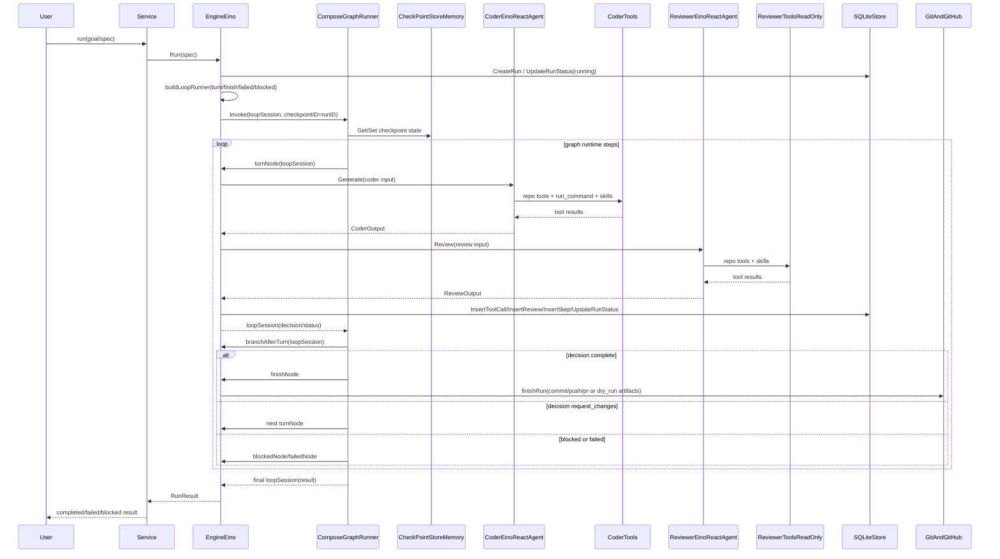
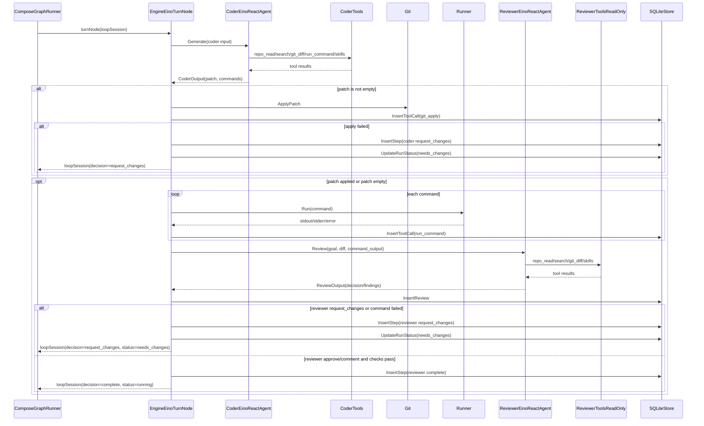

# Eino Agent 编排实现说明

本文只描述当前项目中的 Eino 实现（默认实现）。

## 1. 当前实现结论

- 运行时采用 Eino 完成 Agent 编排与循环调度。
- CLI/HTTP 对外接口保持不变，内部由 Eino 图编排驱动。
- 编排核心：
  - Agent 层：`react.Agent + tools`
  - Loop 层：`compose.Graph + branch + checkpoint`

## 2. 关键代码入口

- Loop 引擎：`/Users/kina/Code/Agent/Coding-Agent-Loop/agent-coding-loop/internal/loop/engine_eino.go`
- Coder Agent：`/Users/kina/Code/Agent/Coding-Agent-Loop/agent-coding-loop/internal/agent/coder_eino.go`
- Reviewer Agent：`/Users/kina/Code/Agent/Coding-Agent-Loop/agent-coding-loop/internal/agent/reviewer_eino.go`
- 模型适配：`/Users/kina/Code/Agent/Coding-Agent-Loop/agent-coding-loop/internal/agent/client_eino.go`
- Eino Tools：`/Users/kina/Code/Agent/Coding-Agent-Loop/agent-coding-loop/internal/tools/eino_tools.go`
- 服务入口：`/Users/kina/Code/Agent/Coding-Agent-Loop/agent-coding-loop/internal/service/service.go`

## 3. 编排分层

### 3.1 模型层

通过 Eino OpenAI ChatModel 适配 OpenAI-compatible 接口：
- `openai.NewChatModel(...)`
- 位置：`/Users/kina/Code/Agent/Coding-Agent-Loop/agent-coding-loop/internal/agent/client_eino.go:27`

### 3.2 Agent 层

Coder/Reviewer 都通过 `react.NewAgent(...)` 构造：
- Coder：`/Users/kina/Code/Agent/Coding-Agent-Loop/agent-coding-loop/internal/agent/coder_eino.go:99`
- Reviewer：`/Users/kina/Code/Agent/Coding-Agent-Loop/agent-coding-loop/internal/agent/reviewer_eino.go:106`

特点：
- Coder 挂载可执行工具集（含 `run_command`）。
- Reviewer 挂载只读工具集（不含 `run_command`）。
- 二者都返回结构化 JSON，便于 loop 做分支决策。

### 3.3 Loop 层

Loop 使用 Eino Graph：
- 建图：`turn -> (branch) -> turn/finish/failed/blocked`
- 位置：`/Users/kina/Code/Agent/Coding-Agent-Loop/agent-coding-loop/internal/loop/engine_eino.go:245`
- 路由：`/Users/kina/Code/Agent/Coding-Agent-Loop/agent-coding-loop/internal/loop/engine_eino.go:453`

核心思想：
- `turnNode` 只负责“单轮业务”。
- 下一步走向由 `branchAfterTurn` 统一决策。

## 4. Tools 设计与权限边界

Eino 工具通过 `utils.InferTool` 构建：
- `repo_list`, `repo_read`, `repo_search`
- `git_diff`
- `kb_search`（只读，外部知识库检索）
- `list_skills`, `view_skill`
- `run_command`（仅 coder）

代码位置：
- `/Users/kina/Code/Agent/Coding-Agent-Loop/agent-coding-loop/internal/tools/eino_tools.go`

安全边界：
- 危险命令拦截：`IsDangerousCommand`
  - `/Users/kina/Code/Agent/Coding-Agent-Loop/agent-coding-loop/internal/tools/command.go:56`
- 只读模式拦截写命令：`IsWriteCommand`
  - `/Users/kina/Code/Agent/Coding-Agent-Loop/agent-coding-loop/internal/tools/command.go:74`

## 4.1 外部知识库（LanceDB Sidecar）

知识库检索通过本仓库内的 Python sidecar 提供 HTTP API：
- 路径：`Coding-Agent-Loop/agent-coding-loop/kb/server.py`
- 端口：默认 `127.0.0.1:8788`
- 环境变量：`AGENT_LOOP_KB_URL`（Go 侧 KB URL）、`OPENAI_BASE_URL`、`OPENAI_EMBEDDING_MODEL`、`OPENAI_API_KEY`、`KB_EMBEDDING_PROVIDER`、`KB_LOCAL_EMBED_MODEL`、`KB_EMBEDDING_SOURCE`

工具 `kb_search` 会请求 sidecar 的 `/search` 并返回带引用的 chunks（包含 path/offset），用于 Agentic RAG。

## 5. Loop 状态流转

单轮 `turnNode` 处理顺序：
1. 调 Coder 生成 `patch/commands`
2. 如有 patch，执行 `git_apply`
3. 执行 commands 并记录工具调用
4. 调 Reviewer 给出 `decision/findings`
5. 写入 steps/reviews/run_status，并产出 `LoopDecision`

分支规则：
- `complete` -> `finishNode`
- `request_changes` -> 回到 `turnNode`（若未超过迭代上限）
- `abort` 或失败态 -> `failedNode`
- 阻塞态 -> `blockedNode`

参考代码：
- `/Users/kina/Code/Agent/Coding-Agent-Loop/agent-coding-loop/internal/loop/engine_eino.go:282`
- `/Users/kina/Code/Agent/Coding-Agent-Loop/agent-coding-loop/internal/loop/engine_eino.go:453`

## 6. Checkpoint 与恢复

Graph 调用时注入 checkpoint：
- `compose.WithCheckPointStore(...)`
- `compose.WithCheckPointID(runID)`
- 位置：`/Users/kina/Code/Agent/Coding-Agent-Loop/agent-coding-loop/internal/loop/engine_eino.go:225`

当前 checkpoint store 为进程内存实现：
- `/Users/kina/Code/Agent/Coding-Agent-Loop/agent-coding-loop/internal/loop/engine_eino.go:79`

恢复语义：
- 运行状态与事件时间线落 SQLite（`runs/steps/tool_calls/reviews/artifacts`）。
- `resume` 通过 runID 继续执行主流程。

## 7. 端到端时序图（Eino）

## 8. `turnNode` 单轮子流程图

## 9. 建议阅读顺序

1. `/Users/kina/Code/Agent/Coding-Agent-Loop/agent-coding-loop/internal/tools/eino_tools.go`
2. `/Users/kina/Code/Agent/Coding-Agent-Loop/agent-coding-loop/internal/agent/coder_eino.go`
3. `/Users/kina/Code/Agent/Coding-Agent-Loop/agent-coding-loop/internal/agent/reviewer_eino.go`
4. `/Users/kina/Code/Agent/Coding-Agent-Loop/agent-coding-loop/internal/loop/engine_eino.go`
5. `/Users/kina/Code/Agent/Coding-Agent-Loop/agent-coding-loop/internal/service/service.go`
