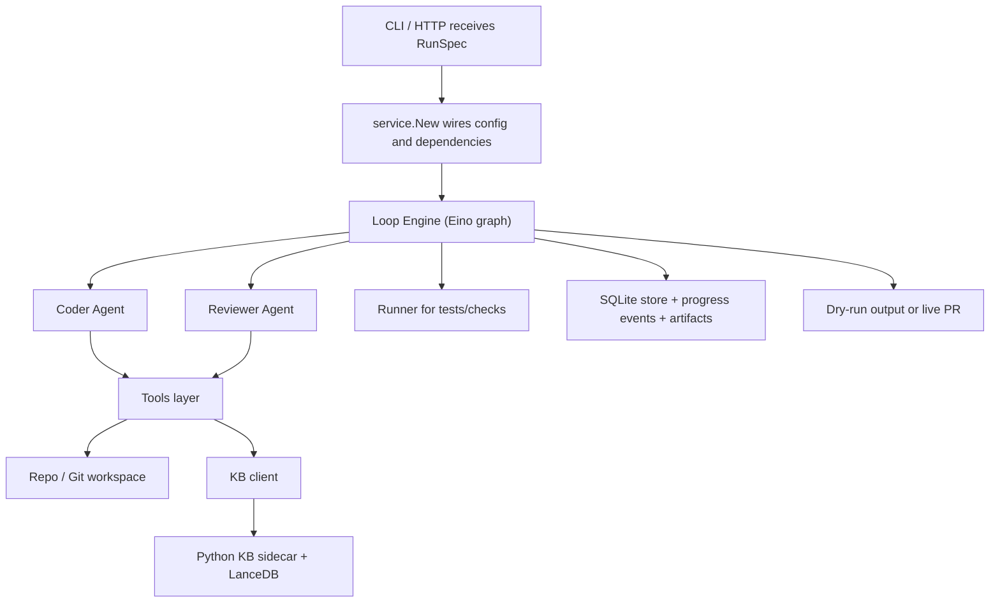
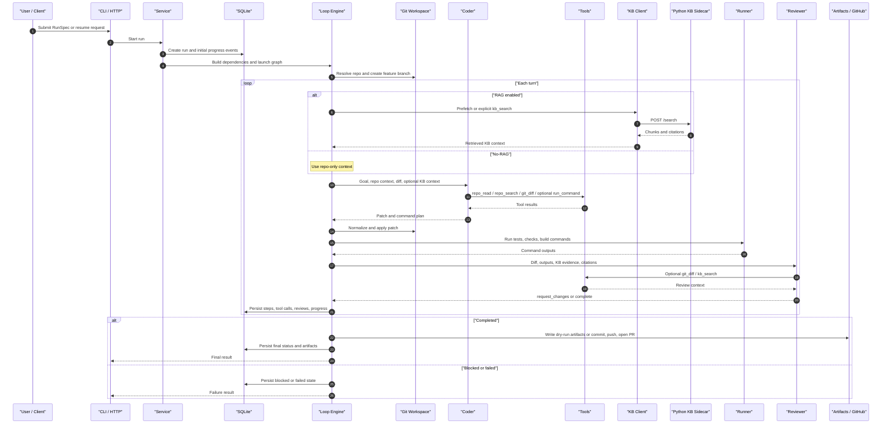
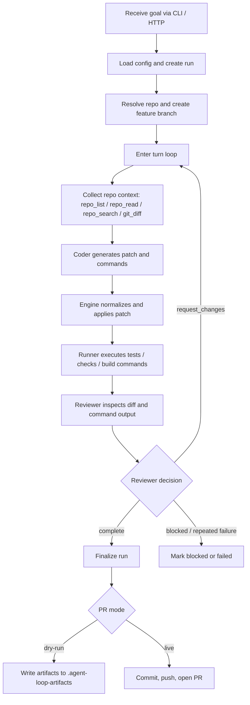
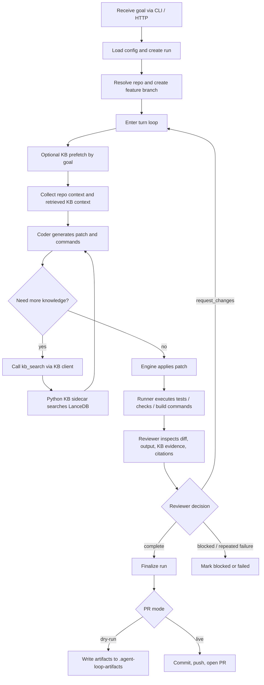

# Agent Coding Loop: 项目现状与架构设计（2026-03-20）

## 1. 项目现状总结

### 1.1 这个项目当前到底是什么

当前仓库实现的核心不是一个“只服务 Obsidian 的成品 RAG 应用”，而是一套可本地运行、可恢复、可审计、可接入知识库的 coding agent runtime。  
它的主链路是：

`goal -> coder -> patch/apply -> tests/checks -> reviewer -> finish / blocked / PR`

Obsidian Vault 在这套架构里更像一个可选知识源，而不是系统本体。

### 1.2 到 2026-03-20 的实现结论

从代码、测试、构建和本地运行痕迹综合判断，这个项目已经具备完整主闭环，但仍处在“可靠性和运行稳定性持续打磨”的阶段。

当前可以明确确认的状态：

- CLI 与 HTTP 入口完整，支持 `run`、`serve`、`resume`、`inspect`，也支持异步 API 和事件流。
- Eino 图编排主循环完整，支持 checkpoint、resume、feature branch、multi-turn 审核回路。
- Coder / Reviewer 双 agent 主链路完整，且都带 fallback。
- RAG 链路不是空壳，已经有 `kb_search`、prefetch 模式、Python KB sidecar、LanceDB 存储。
- SQLite 状态持久化、artifact 输出、progress event 可观测性都已具备。
- 最新代码已增加 Responses API 适配层，可对接 `/v1/responses` 风格后端。
- 评测侧在 2026-03-18 新增了 24 任务 benchmark suite，A/B 评测框架比早期更完整。

### 1.3 这次检查到的最新事实

#### 代码与分支状态

- 当前主分支是 `main`，并跟踪 `origin/main`。
- 本地工作树不是完全干净，存在未跟踪构建产物：`bin/agent-loop`。
- 最新提交时间已经到 2026-03-19。

最近几次关键提交：

- `11e0bce` `feat: add responses API transport adapter`
- `fff60eb` `eval: add 24-task benchmark suite`
- `2e852ce` `fix: use run ID for feature branch names`
- `8c27600` `fix: use wall duration when DB run status is not terminal`
- `82d7847` `Harden resume recovery and unify Eino JSON repair`

#### 本次已重新验证的结果

- `go test ./...`：通过
- `go build ./cmd/agent-loop`：通过

这说明当前代码基线在编译和单元/集成测试层面是健康的。

#### 本地运行数据库状态

基于 `.agent-loop-artifacts/state.db` 当前统计：

- `failed`: 459
- `completed`: 267
- `running`: 18
- `blocked`: 6
- 最新 run 更新时间：`2026-03-19 17:30:07`

另外，已完成 run 里依然存在较明显的 fallback reviewer 痕迹：

- summary 包含 `Fallback reviewer approved` 的 completed run：212
- summary 包含 `Eino review failed` 的 completed run：209

最近 6 条 run 记录全部是 `failed`，说明“功能闭环存在”不等于“当前运行稳定性已经足够好”。

### 1.4 当前阶段判断

一句话概括：

这个项目已经不是 demo，而是一套结构完整、可以真实跑起来的 agent runtime；但从最新运行数据看，系统仍在解决 reviewer 稳定性、失败恢复和端到端成功率的问题。

---

## 2. 架构设计总览

### 2.1 分层结构

| 层级 | 主要职责 | 当前状态 |
| --- | --- | --- |
| 接入层 | CLI、HTTP API、resume、inspect、事件流 | 已实现 |
| 配置装配层 | 读取 env/config，组装 store、git、github、skills、KB、agents | 已实现 |
| 编排层 | Eino graph 驱动多轮 turn，处理 finish/failed/blocked | 已实现 |
| Agent 层 | coder 生成 patch 与命令，reviewer 审核 diff 与执行输出 | 已实现 |
| Tool 层 | `repo_list`、`repo_read`、`repo_search`、`git_diff`、`kb_search`、`run_command` | 已实现 |
| 安全层 | 危险命令拦截、只读 runner、敏感 env 过滤 | 已实现 |
| RAG 层 | KB client + Python sidecar + LanceDB + prefetch / explicit search | 已实现 |
| 持久化层 | SQLite 记录 runs、steps、tool_calls、reviews、artifacts、progress_events | 已实现 |
| 交付层 | dry-run artifacts 或 live PR | 已实现 |
| 评测层 | `eval`、A/B、24-task benchmark suite | 已实现并持续扩展 |

### 2.2 关键组件关系

### 2.3 端到端时序图

### 2.4 关键设计点

#### 1. 编排和执行分离

LLM 不直接随意改仓库。主修改路径仍然是：

`coder 产出 patch -> engine 规范化并 apply -> runner 执行命令 -> reviewer 审核`

这样做的好处是：

- 修改过程可审计
- 可以做 checkpoint / resume
- 可以记录失败点
- 可以在 reviewer 阶段做 gate

#### 2. RAG 是可插拔能力，不是主循环前提

系统支持两种运行模式：

- No-RAG：完全基于 repo 上下文工作
- RAG：在 repo 上下文之外，再引入知识库检索

这意味着系统本质上是 agent runtime，RAG 只是增强项。

#### 3. Reviewer 是质量闸门

Reviewer 读取：

- 当前 diff
- 命令执行输出
- KB 调用结果
- 可能的引用信息

然后决定：

- `request_changes`
- `complete`
- `blocked`

这也是系统从“单次补丁生成器”走向“多轮修正循环”的关键。

#### 4. 持久化优先于“只看终态”

系统把运行过程拆成结构化记录落库，而不是只保存最终 patch。  
这使它天然适合：

- `resume`
- 调试失败 run
- 做 A/B 分析
- 汇总成功率、时延、失败模式

---

## 3. No-RAG 任务流程图

### 3.1 说明

No-RAG 模式下，agent 只依赖 repo、git diff、命令输出和 reviewer 审核，不接知识库检索。

### 3.2 流程图

### 3.3 No-RAG 的特点

- 优点是链路简单、依赖更少、调试更直接。
- 局限是只能依赖代码仓库内已有信息，无法利用外部设计文档、团队约束或知识库规范。

---

## 4. RAG 任务流程图

### 4.1 说明

RAG 模式下，主循环仍然和 No-RAG 一样，但会在合适位置引入知识库检索。  
知识库内容可以来自 Obsidian Vault、项目文档、评测文档或其他本地知识源。

系统里主要有两种 RAG 介入方式：

- `prefetch`：每轮开始前按目标先查一次 KB，把结果直接塞进上下文
- `kb_search`：coder 或 reviewer 在需要时显式调用知识库检索工具

### 4.2 流程图

### 4.3 RAG 的特点

- 优点是可以把 repo 之外的规则、规范、设计文档、运维知识引入决策过程。
- 对 `KB-only` 和 `KB-guided` 任务更有价值。
- 局限是链路更长，依赖 KB sidecar、embedding、索引质量和引用约束。
- 如果 reviewer 对 KB 证据或 JSON 输出不稳定，RAG 任务更容易暴露系统脆弱点。

---

## 5. No-RAG 与 RAG 对照

| 维度 | No-RAG | RAG |
| --- | --- | --- |
| 上下文来源 | repo、git diff、命令输出 | repo + KB 检索结果 |
| 外部依赖 | 低 | 更高，需要 KB sidecar / embedding / index |
| 适合任务 | repo-only 修复、简单改动、直接代码问题 | KB-only、KB-guided、依赖文档规范的任务 |
| 调试复杂度 | 相对更低 | 相对更高 |
| 失败模式 | patch apply、命令失败、reviewer 判定失败 | 上述问题 + 检索质量、引用命中、KB tool 调用稳定性 |
| 收益来源 | 代码内证据 | 代码内证据 + 外部知识 |

---

## 6. 评测与实验设计现状

### 6.1 当前评测能力

仓库已经具备一套比较完整的评测能力：

- retrieval 评估
- RAG QA 评估
- coding agent A/B 对比
- 单任务跑分与批量 benchmark

### 6.2 最近新增内容

到 2026-03-18，`eval/ab` 已新增 24 任务 benchmark suite。  
这说明项目已经不满足于“能不能跑”，而是在往“如何系统验证 No-RAG 与 RAG 的差异”推进。

新 benchmark 的意义主要有三点：

- 任务覆盖比最初 minimal set 更完整
- 可以更系统地比较 `repo_only`、`kb_only`、`kb_guided_code`、`kb_mixed`
- 为后续做稳定性回归、模型切换和检索策略对比提供统一数据集

---

## 7. 当前风险点

### 7.1 运行稳定性仍然是主要风险

虽然测试和构建通过，但本地历史运行数据里：

- `failed` 数量明显高于 `completed`
- 仍有 `running` 和 `blocked` 残留
- 最近 run 记录仍出现连续失败

这说明当前问题不主要在“功能缺没缺”，而在“真实运行时能不能稳定闭环”。

### 7.2 Reviewer 依然是脆弱点

大量 summary 同时出现：

- `Fallback reviewer approved`
- `Eino review failed`

这说明 reviewer 主路径虽然存在，但在真实运行中仍然经常依赖 fallback 兜底。  
如果 reviewer 的结构化输出、JSON repair、citation 校验不稳定，整个系统成功率就会受影响。

### 7.3 RAG 链路的可变因素更多

RAG 的整体效果不仅取决于模型本身，还取决于：

- 知识库内容质量
- chunk 切分策略
- embedding 模型
- 索引状态
- 检索模式
- reviewer 对引用和证据的严格程度

所以 RAG 任务失败时，不一定是 coder 变差，也可能是检索或验证链路失稳。

---

## 8. 下一步建议

如果要判断“这版系统现在到底能不能稳定用”，建议按下面顺序验证：

1. 先做最小 dry-run smoke test  
   用一个 repo-only 小任务验证当前主循环能否稳定从 goal 跑到 artifacts 输出。

2. 再做一组最小 No-RAG / RAG 对照  
   对同一批任务分别开关 KB，观察成功率、时延、fallback 比例和引用命中。

3. 单独检查 reviewer 失败模式  
   聚焦 `Eino review failed`、fallback approval、blocked run 的真实原因，而不是只看总成功率。

4. 最后再跑 24-task benchmark suite  
   这一步更适合作为回归验证，而不是第一次判断系统是否可用。

---

## 9. 最终结论

截至 2026-03-20，Agent Coding Loop 的状态可以概括为：

- 架构已经完整，No-RAG 和 RAG 两条主链路都具备工程实现。
- 测试和构建基线是健康的。
- 系统最近还在持续演进，尤其是 Responses API 适配、benchmark 扩展和 branch naming 稳定性。
- 但从最新本地运行数据看，运行稳定性与 reviewer 主路径可靠性仍然是当前最核心的问题。

因此，当前项目最准确的定位不是“还在搭框架”，也不是“已经完全成熟”，而是：

**一套已经做出完整产品骨架并可真实运行的 agent runtime，当前工作重点是把端到端成功率和运行稳定性打磨到足够可靠。**
